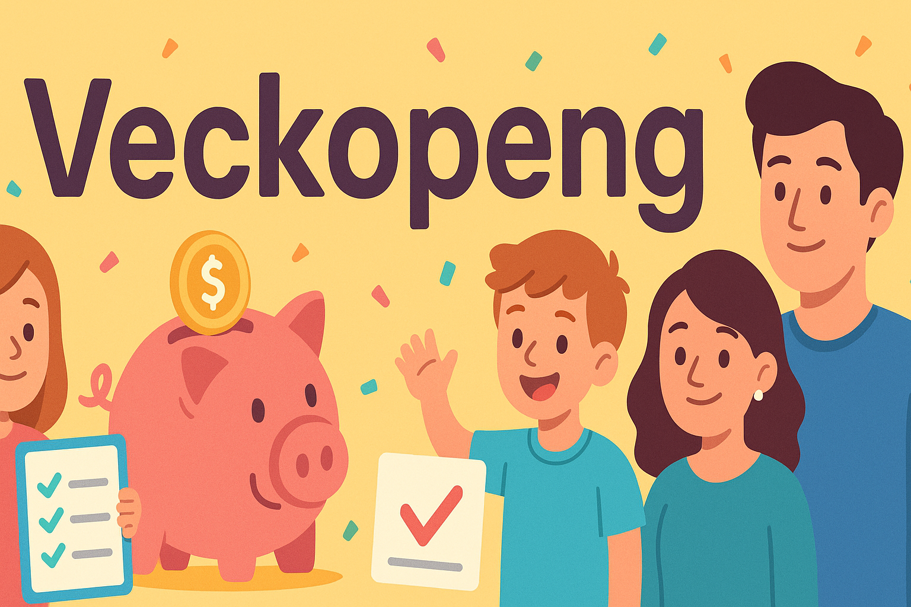

# Veckopeng

_A tiny self-hosted app that turns **weekly chores** into **weekly cash**_

Parents create tasks → kids complete them → parents approve → payment app opens with amount pre-filled.  
No ads. No cloud SaaS. Just you, your homelab, and some very motivated children.

---

## ✨ What is Veckopeng?

In Swedish, **“veckopeng”** is the weekly allowance kids get for helping out.  
This app is exactly that:

- A **family chore + allowance dashboard** for parents
- A **“My Week” mission board** for kids
- A **launchpad to your payment app** with the right amount ready to send

You self-host it (Docker), connect it to your phone, and let your kids grind IRL XP.

---

## 🧹 Core Features

### 👨‍👩‍👧 Family accounts

- Create **parents** and **children**
- Each profile has:
  - Name
  - 4-digit PIN for login
  - Cute **avatar emoji** (kids pick their own)
  - Payment identifier (Swish number, PayPal.me handle, Venmo user, Cash App cashtag)
  - Balance, total earned and optional weekly allowance
- Parents see everything, kids only see their own stuff.

---

### ✅ Tasks & approvals

- Parents create **tasks** with:
  - Title & description
  - Reward amount (in kronor or your configured currency)
  - Assigned child
- Kids see tasks on their **“My Week”** view:
  - Tap **“Complete”** when done
  - Task moves to **“Waiting for approval”**
- Parents:
  - See all “Waiting for approval” tasks
  - Click **Approve** or **Deny**
  - Approved tasks add to the child’s **balance** and **total earned**

All data is stored in a **SQLite database** on your server — not in the browser, not in the cloud.

---

### 💸 Payments (Swish, PayPal.me, Venmo, Cash App)

When a child has earned money:

1. Parent goes to **Overview → Children balances**
2. Clicks **Pay** on a child
3. Veckopeng:
   - Calculates the child’s current balance
   - Builds a **deep link** to the right payment app
   - Opens it with **amount and identifier pre-filled** (as much as each service allows)
4. You confirm the payment in the external app
5. Back in Veckopeng you click **“Yes, payment is done”**
6. The child’s balance is **reset to 0** (but their total earned history remains)

Currently supported:

- 🟦 **Swish** – mobile payment (Sweden)
- 💲 **PayPal.me** – `https://paypal.me/username/amountCURRENCY` style links
- 💜 **Venmo** – deep links with username & amount
- 💚 **Cash App** – cashtag + amount links

> ℹ️ Veckopeng never moves money itself.  
> It just opens the correct app/URL on your device with as much prefill as possible.

---

### 👦 “My Week” – child view

When a child logs in, they see:

- **Greeting**: “Hi \<name\> 👋”
- **Total earned** (all time)
- **This week’s earnings**
- Optional **weekly allowance progress bar**
  - Current week’s earnings vs weekly allowance
  - Extra “bonus” earnings highlighted if they went above allowance
- Three status cards:
  - **Pending tasks** – “Waiting for you to complete.”
  - **Waiting for approval** – “Your parent will check these soon.”
  - **Completed tasks** – “Great job!”
- Their own task list with:
  - **To do** tab – tasks they can complete & mark as done
  - **History** tab – completed tasks

---

### 🧑‍💼 Parent overview

The **Overview** tab for parents shows:

- Global stats:
  - Total tasks
  - Pending tasks
  - Tasks waiting for approval
  - Total amount **“To be paid”** (sum of all kids’ balances)
- **“This week per child”** cards:
  - Avatar & name
  - Current balance
  - Weekly allowance progress bar (if set)
  - Counts for:
    - Pending
    - Waiting for approval
    - Completed
- Children balances list:
  - Each child’s avatar, name & balance
  - **Pay** button to trigger the deep link to Swish / PayPal.me / Venmo / Cash App

---

### 👪 Family management

In the **Family** tab (parents only):

- See **Parents** and **Children** separately
- Add new members:
  - Choose **Parent** or **Child**
  - Name + 4-digit PIN
  - Avatar emoji picker
- Edit child details:
  - Phone / payment identifier
  - Default payment method (Swish / PayPal.me / Venmo / Cash App)
  - Currency
  - Current balance
  - Total earned
  - Weekly allowance

All changes are immediately synced to the backend database (SQLite).

---

### 🌙 Dark mode & UI stuff

- Full **light/dark mode** support
- Mobile-friendly layout (designed for phones first, but works great on desktop)
- Clean, card-based design:
  - Overview
  - Tasks
  - My Week
  - Family
- Fun iconography & emojis for kids, but still readable for grown-ups with too many meetings

---

## 🏗 Tech stack

Under the hood:

- **Frontend**
  - React + TypeScript
  - Vite
- **Backend**
  - Node.js + Express
  - TypeScript
- **Database**
  - SQLite (single file, persisted via Docker volume)
- **Deployment**
  - Docker + docker-compose
  - Built to run in a homelab / on a NAS / small server

All core app data (users, tasks, approvals, balances) lives in the **database**, not in browser storage.

---

## 🚀 Getting started (Docker)

### 1. Clone the repo

```bash
git clone https://github.com/daevilb/veckopeng.git
cd veckopeng
docker compose up -d --build
```

## Follow the first-time setup:

Create your parent account (with avatar & PIN)
Add your children
Add tasks
Hand the device to your kids or create a shortcut to veckopeng from their own device and watch the chores mysteriously get done

## 🔐 Data & privacy

Everything runs in your environment (homelab, NAS, VPS, etc.)
No third-party databases or analytics
SQLite database stored on your own disk (via Docker volume)
Payments are always performed in the official payment apps – Veckopeng only crafts the links

## 🧭 Roadmap / ideas
```
Things I’d like to add over time:
📅 Recurring tasks (e.g. “every Saturday”)
📊 More history / charts per child
🌍 Localization (Swedish / English toggle in the UI)
📱 Native mobile wrapper / Android app
🔔 Optional notifications (e.g. via e-mail or push gateway)

If you have ideas or feature requests, open an issue or PR!
```
